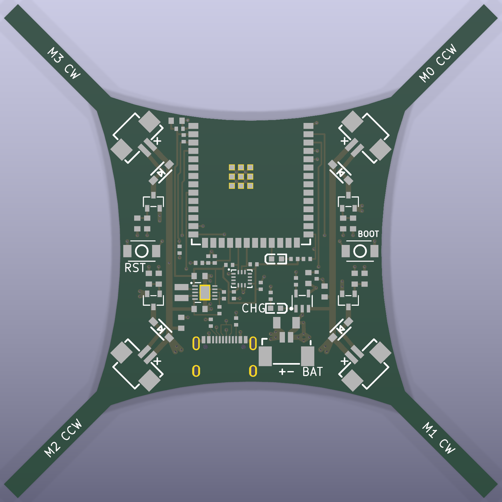

# quad pcb

Flight controller and frame on a single 2‑layer PCB, written in
[tscircuit](https://tscircuit.com). `index.tsx` is the whole design: parts,
schematic, placement and every copper track (drawn by hand, no autorouter).
The four arms are the frame; the electronics sit in the 44.8 mm core. Each
motor connector sits in its corner with the cable opening facing down the arm.



Schematic: [img/schematic.svg](img/schematic.svg) · KiCad files (to look
around, measure, run DRC/ERC): [kicad/](kicad/).

## Order it (no install needed)

The ready‑made files are in [fab/](fab/). On jlcpcb.com:

1. *Order now* → upload `fab/gerbers.zip`. The viewer should show a
   75.12 × 75.12 mm, 2‑layer board with the USB‑C slots drawn. 1.6 mm, FR‑4,
   any colour. Via covering: *tented* (the default). Surface finish: the
   form defaults to leaded HASL – pick lead‑free HASL, or ENIG (flatter pads
   for the IMU's 0.5 mm LGA). *Remove order number*: choose *Specify a
   location* – the back has a `JLCJLCJLCJLC` spot for it.
2. Tick *PCB Assembly*, top side, **Standard** (the ESP32 module and the IMU
   are Standard‑only; about $170 for assembly and parts of 5 boards, Sep
   2026). Upload `fab/bom.csv` and `fab/cpl.csv`. Every row has its JLCPCB
   part number and all are in stock. Seven are *extended* parts (module,
   IMU, TPS63001, inductor, the three connector types), the rest *basic* or
   *preferred* – which only matters for Economic PCBA: Standard charges the
   same feeder fee (about $1.53) for each of the 26 BOM lines. Tick *Confirm
   production file* and look at the panel drawing before it goes into
   production.
3. Order remark: "The ESP32 module and the USB‑C socket overhang the nose
   and tail edges on purpose. Break‑off tabs only on the end faces of the
   arms – none on the curved core outline (the motor connectors, C13 and
   both buttons are within 0.45 mm of it). Please cut the stencil from our
   F_Paste layer." Standard PCBA always adds rails and fiducials; file the
   tab nubs at the arm tips flush before fitting the motor clips.
4. In the placement preview check each part once: antenna toward the nose,
   USB‑C opening at the tail edge, the diode bands (cathode) on the inner end
   of D1–D4 where each diode meets its VBAT rail, LED anodes toward their 1 k
   resistor (LED1 → R11, LED2 → R17), the IMU's pin‑1 dot (top‑left corner),
   U3's pin 1 at the silkscreen dot (top‑left, toward the inductor), U4 pin 1.
   `cpl.csv` already places every part at JLCPCB's own footprint origin.

## What is on it

| Block | Part | JLCPCB # |
|---|---|---|
| MCU | ESP32‑S3‑WROOM‑1‑N16R8, antenna over the nose edge | C2913202 |
| IMU | BMI323, I2C at 0x68, +X = nose, +Y = left, +Z = up | C5368700 |
| Motor drive ×4 | AO3400A low‑side, 47 Ω gate, 10 k pull‑down, B5819W flyback | C20917, C8598 |
| Motor connectors ×4 | HC‑1.25‑2PWT (1.25 mm, 2 pin), "+" marked on the silkscreen | C2845379 |
| Battery | Molex PicoBlade 53398‑0271, "+"/"−" marked, 100 µF bulk | C122410, C15008 |
| 3.3 V | TPS63001 buck‑boost: 3.3 V from 1.8–5.5 V in (1.2 A buck, 0.8 A boost), always on, power‑save mode at light load, 2.2 µH | C28060, C5832372 |
| Charger | TP4054, 190 mA (R16 = 5.1 k, datasheet formula 1), CHG LED | C32574 |
| USB | USB‑C, native S3 USB (flashing + console), 5.1 k CC pull‑downs | C2765186 |
| Buttons | RST (EN, left edge) and BOOT (IO0, right edge), top‑actuated | C720477 |
| Battery sense | VBAT / 2 on IO10 (100 k / 100 k, 100 nF) | |
| UART pads | TX, RX, GND on the back (TP1–TP3) | |

Pin map (also on the schematic, and in `firmware/main/main.c`):

| GPIO | Use |
|---|---|
| IO1, IO2, IO16, IO4 | PWM0–3 → M0 front right, M1 back right, M2 back left, M3 front left (high = on) |
| IO11, IO12 | I2C SDA, SCL (BMI323) |
| IO10 | battery voltage / 2 (ADC1 channel 9, use 12 dB attenuation) |
| IO21 | LED1, active low |
| IO19, IO20 | USB D−, D+ |
| IO0 / EN | BOOT / RESET buttons |
| TXD0, RXD0 | UART0 pads TP1, TP2 |

Motors: FR and BL spin CCW, BR and FL spin CW (printed on each arm). The
connector pin marked "+" is VBAT; the other pin is switched to ground. The
pinout and the connector positions match the May 2026 board, so its motor
leads plug in the same way and reach just as far: each connector sits as far
out along its arm as its metal side tabs allow (0.33 mm from the curved
edge), its opening about 24.8 mm from the arm tip.
A brushed motor's direction follows its polarity – if one spins the wrong
way, swap its two wires.

Copper: bottom layer is a ground pour; VBAT runs 1 mm wide on top plus a
1.5 mm bus on the bottom from the battery connector; motor nets 0.6–0.8 mm;
vias 0.3/0.6 mm. The buck‑boost follows its datasheet layout: input and
output caps right at VIN/VOUT with their grounds straight into the exposed
pad, the inductor beside the VBAT rail, unbroken ground pour underneath
(the USB data pair runs past it, between converter and IMU).

The motor connectors' "+" pins match the May 2026 boards. The November 2025
board had front‑left and back‑right the other way round: leads made for that
board spin FL/BR backwards here. Check each motor's direction with the props
off (BLE keys `1`–`4`).

## Change the design

Needs Node ≥ 20; `npm install` brings everything else (including `bun`) and
applies the small tscircuit fixes in `scripts/patch-tscircuit.mjs`.

```bash
cd pcb
npm install
npm run build   # ~10 s: dist/circuit.json (board) + dist/sch.circuit.json (schematic), then DRC
npm run fab     # fab/gerbers.zip, fab/bom.csv, fab/cpl.csv
npm run kicad   # kicad/quad.kicad_pcb, .kicad_sch, .kicad_pro
npm run img     # img/pcb.png, img/schematic.svg
npm run place   # placement only (no copper) -> img/place.png
npm run dev     # live PCB / schematic / 3D view at http://localhost:3020
```

* `build.tsx` replaces `tsci build` (whose built‑in checks can hang). It
  renders the board twice: once with the copper for the PCB, once without it
  for the schematic, since tscircuit would otherwise draw the hand‑made PCB
  tracks into the schematic.
* `scripts/silk.ts` drops unprintable footprint texts and clips silkscreen
  lines 0.15 mm off pads, holes and the board edge (what JLCPCB would clip).
* `scripts/jlc.ts` writes the BOM and a CPL at JLCPCB's footprint origins
  (tscircuit's own pick‑and‑place uses pad centres, which is off for the
  module, USB‑C and connectors). `npm run fab` also puts each USB‑C slot's
  `G85` on one line in the drill file, as Excellon wants it.
* The exposed pad of U3 gets TI's stencil (two 1.5 × 1.06 mm openings at
  ±0.63 mm, 80 %)
  instead of a full opening, so the part doesn't float (`build.tsx`).
* `scripts/kicad.ts` touches up the KiCad export so KiCad reads it right:
  real power symbols, correct diode/connector pin numbers, net ties at
  junctions, no‑connect flags, JLCPCB design rules, text sizes as printed.
  The ground pour comes without fill: press **B** in KiCad to fill it.
* `footprints/` caches the JLCPCB footprints (some edited: USB‑C slots,
  a connector courtyard, TPS63001 exposed pad as TI's 1.65 × 2.4 mm land,
  inductor pads as its maker recommends),
  so builds work offline.
* `drc.py` is an independent check (`pip install shapely`): 0.2 mm copper
  clearance, 0.3 mm to the edge, via sizes, and that every net is one piece
  of copper: `python3 drc.py`.

## Checked before release

* tscircuit DRC (routing, placement, netlist, JLCPCB rules) and `drc.py`: clean.
* KiCad 9 DRC on the exported board with JLCPCB limits, zones refilled: clean;
  KiCad ERC on the schematic: clean.
* The netlist KiCad computes from the drawn schematic, and the connectivity
  extracted from the gerber copper + drill files, both equal the design
  netlist pin for pin (no opens, no shorts).
* Silkscreen in the gerbers: ≥ 0.15 mm from every pad and hole. Labels print
  about 1.0 mm tall with ≥ 0.16 mm strokes (BOOT 0.75 mm: it sits between a
  via and the edge); the "+"/"−" polarity marks are 1.0–1.2 mm lines.
* Every part checked against its datasheet (pinout vs footprint vs netlist,
  application circuit, ratings), each finding re‑checked independently.

## First power‑up

1. Meter every battery lead before its first plug‑in. Under the battery
   socket the silkscreen reads "+ − BAT": the pin above the "+" (the one
   farther from `BAT`) must get the pack's +. A reversed pack destroys the
   board. Motors go into the four arm sockets, the battery only into the
   `BAT` socket: a battery plug fits a motor socket too, and in two of them
   it shorts the pack through a diode.
2. Props off. Plug the battery in: LED1 blinks at 1 Hz within about 2 s
   (5 Hz: IMU not found; dark: the pack is below 3.0 V and the board sleeps
   – charge it – or look for a short or a dead 3.3 V). Nothing spins at
   power‑up.
3. Connect with `firmware/tools/motor_keys.py` (`pip install bleak`). It
   prints the status (reset reason, IMU id `0x..43`, level calibration,
   battery mV, trim, gain); `?` repeats it. The level calibration runs as soon as the
   board lies still and within 5° of level for 1 s; if it was moved or on a
   slope then, set it on a level surface and press `c`.
4. Tilt by hand and watch the log: `r` goes positive with the right side
   down, `p` positive with the nose down.
5. Keys `1`–`4` spin M0 (front right), M1 (back right), M2 (back left) and
   M3 (front left) for 1 s. Viewed from above, M0 and M2 must turn CCW and M1
   and M3 CW; swap a motor's two wires if not.
6. Still without props: `a` (arm), a few `w`, then tilt the board – the
   motors on the lower side speed up. `d` disarms. Keep a hand on it.
7. First hover, over a soft floor with room around it: `a`, then `w` until
   the quad gets light and lifts off. If it isn't light by throttle ≈ 185,
   stop: motors or props too small for its weight. Keep it about 30 cm up
   with `w`/`x` and hold it in place with the arrow keys (a press tilts it
   4° that way for 0.7 s; hold the key to keep going). It holds itself
   level, not in place: like any toy quad it drifts, and you steer against
   that. Climb briskly off the floor (one `w` more than it needs to lift),
   and after touching down take the throttle to 0 before the next take‑off:
   the integrators need to see the lift‑off (`air` in the log).
8. If it keeps drifting the same way, trim after landing: `i` `k` `j` `l`
   (forward, back, left, right, 0.5° per press) toward where it should go,
   e.g. `i` a few times when it drifts backward. Trim adds to the level
   found at power‑up, so always power up (or press `c`) on a level floor.
9. Fast wobble or buzz: lower the gain with `[`. Slow rocking, overshoot or
   a soft feel: raise it with `]` (×1.25 per press). Trim and gain are
   saved on the drone. The log's `I` columns show how much the integrators
   correct: roll or pitch near ±25 means the weight is far off centre (move
   the battery). Until the log says `air` they stop at ±7.5.

## Limits worth knowing

* **Brown‑outs:** the buck‑boost holds 3.3 V while the battery sags as low
  as 1.8 V, so motor current can no longer reset the ESP32 (the old boards
  fed it from an LDO, or from the motor rail itself). The firmware logs the
  reset reason at boot; `BROWN-OUT` there would mean something else is wrong.
* **Packs:** fly RC LiPos without a protection board, rated for the 2–6 A
  the four motors pull (6 A is 35 C from 170 mAh, 24 C from 250 mAh). A
  phone‑type cell with a protection PCB, such as a generic LP502030
  "250 mAh", is made for about 0.5 C, and its protection typically cuts off
  at 2–3 A: it can switch the whole board off in flight. That looks like a
  brown‑out, but after re‑plugging the reset reason reads 1 (power‑on),
  not `BROWN-OUT`. Keep such cells for the bench.
* **Low battery:** because the ESP32 keeps running on a nearly empty pack,
  only the firmware protects it: it logs VBAT (IO10) with every status line,
  warns below 3.3 V while armed and won't arm below 3.5 V. Disarmed below
  3.3 V for 10 s (or below 3.0 V for 1 s) it goes to deep sleep (about 0.1 mA
  for the whole board, the converter in power‑save mode) and checks again
  every 5 minutes (every 30 below 3.0 V); above 3.5 V (e.g. after charging
  over USB) it starts
  normally (press RST to skip the wait). To flash a board that is asleep,
  hold BOOT and tap RST. Running and idle it draws about 50 mA, so a pack
  left plugged in is down to 3.3 V within hours – unplug it after flying.
* **Battery connector (the one real compromise):** PicoBlade contacts are
  rated 1 A, but CN5 carries all four motors – 2–6 A in flight, more at
  spin‑up. It was kept so your existing packs and the May 2026 board's leads
  fit. Expect some extra sag and a warm connector; for hard flying, solder a
  22–24 AWG pigtail with a BT2.0/XT30 plug instead. The 1.25 mm motor
  connectors (also 1 A) are within rating up to about 1 A per motor.
* No reverse‑polarity protection on the battery and no ESD protection on
  USB: see *First power‑up*.
* **Charging:** 190 mA from the charger, of which the running board takes
  about 50 mA: about 140 mA into the pack, and the full 190 mA while a flat
  pack charges with the board asleep – about 1 C for the 170 mAh pack, less
  for 250 mAh. For a pack of 300 mAh or more, R16 = 3.3 k (C25890) gives
  260 mA. There is no temperature sensing: charge attended. While the ESP32
  runs, the charger doesn't terminate (the board draws more than its 19 mA
  end‑of‑charge current), so the CHG LED stays on even when the pack is full
  and the pack is held at 4.2 V: unplug USB once the pack has had time to
  fill (about 1.2 h for 170 mAh, 1.8 h for 250 mAh from empty). Never store a pack plugged in – even asleep the
  board takes it below 3.0 V within days – and don't recharge a pack found
  below about 2.5 V.
* The board may not start from USB alone (the charger only trickles into an
  empty VBAT): plug a charged battery in first, then USB, to flash.
* Firmware (`firmware/main/main.c`): the motors are driven in two phases
  (M0/M2 at the start of each PWM period, M1/M3 at its end), which halves the
  peak battery current below half throttle. Arming needs a BLE link with a
  live heartbeat (`motor_keys.py` sends `h` every 200 ms; any other client
  must too), a finished level calibration, at least 3.5 V and a board within
  5° of level, and starts at zero throttle, where the motors stay off. It
  disarms when the link drops, when the heartbeat stops for 1 s, after 20 s
  armed at zero throttle, after 2 s tilted over 30° with throttle up (stuck
  in grass or against a wall), and beyond 50° of tilt. The attitude loop
  (`firmware/main/flight.c`) was tuned in a simulation of this frame, not
  in flight: expect to adjust the gain with `[` `]`.
* The buttons are pressed from the top. The antenna sits at the nose: keep
  metal and the battery away from it and test BLE range on the first board.
